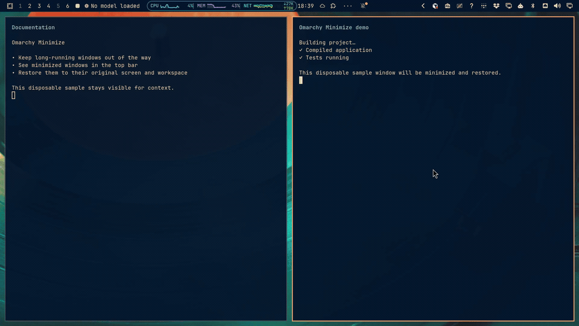
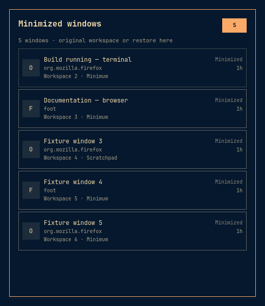
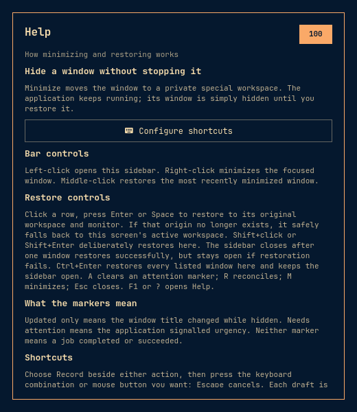
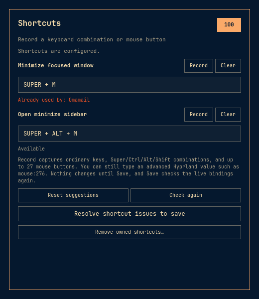
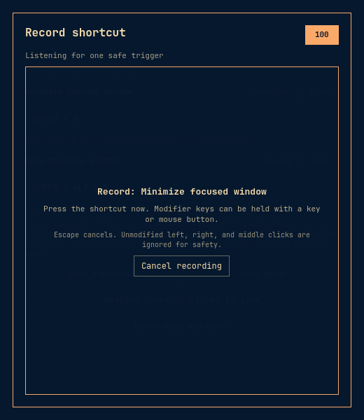

# Omarchy Minimize

Omarchy Minimize is a native Omarchy service and bar widget that moves one
Hyprland window out of the way, keeps a live right-edge list, and restores the
same window by its exact compositor address. It uses `special:minimum` for its
own minimizations and can also list windows already in the Dock and stock
scratchpad aliases.

The live Hyprland client list is the source of truth. Supplemental origin and
attention metadata is compositor-session scoped below `$XDG_RUNTIME_DIR`; the
plugin does not treat another minimizer's cache as authoritative.

## Demo

[](docs/demo.mp4)

▶ [Open the full-quality 28-second MP4](docs/demo.mp4). The demo shows a window
being minimized, the real top-bar indicator updating, the sidebar restoring it
to its original workspace, and the built-in Help page.

## Screenshots

| Minimized-window sidebar | Built-in help |
|---|---|
|  |  |

| Conflict-aware shortcut setup | Keyboard and mouse shortcut recorder |
|---|---|
|  |  |

These captures are generated by the deterministic current-theme UI harness,
which also verifies the corresponding keyboard, accessibility, and state
contracts.

## Install

Third-party Omarchy plugins run unsandboxed inside the shell. Review the source,
then install this repository whose root contains `manifest.json`:

```bash
omarchy plugin add https://github.com/osouthgate/omarchy-minimize.git --enable --yes
```

This enables `osouthgate.minimize` and places its single bar widget in the
right section by default. The plugin has no install hook and does not edit
Hyprland bindings. Open the sidebar's keyboard icon to review and explicitly
save optional shortcuts. The same conflict-checked helper is available from a
terminal:

```bash
plugin_dir="${XDG_CONFIG_HOME:-$HOME/.config}/omarchy/plugins/osouthgate.minimize"
"$plugin_dir/bin/configure-shortcuts" add
"$plugin_dir/bin/configure-shortcuts" status
```

The helper proposes `Super+M` for minimizing and `Super+Alt+M` for toggling the
sidebar. They are suggestions, not assumed-free keys: `Super+M` is already used
on some systems. Choose your own keyboard chord or mouse button at setup time:

```bash
# Keep the default sidebar key, but use another Super-key chord to minimize.
"$plugin_dir/bin/configure-shortcuts" add \
  --minimize-binding 'SUPER + MINUS'

# Or use a dedicated mouse button with no keyboard modifier.
"$plugin_dir/bin/configure-shortcuts" add \
  --minimize-binding 'mouse:275'
```

The sidebar trigger is configurable too with `--sidebar-binding CHORD`. Chords
are case-insensitive on input and accept `SUPER`, `CTRL`, `ALT`, and `SHIFT` in
any order; the helper stores one canonical spelling. Mouse buttons use
Hyprland's `mouse:NUMBER` names. `mouse:272`, `mouse:273`, and `mouse:274` are
left, right, and middle click, so the helper refuses those three without a
modifier rather than capturing normal desktop clicks. A dedicated side or top
button is commonly numbered 275 or above, but hardware mappings vary. Use an
input event viewer such as `wev`, press the intended button once, and copy the
reported button number instead of guessing.

The in-sidebar recorder handles this for the usual case: choose **Record** for
one action, then press the keyboard combination or mouse button you want.
Escape cancels recording. The recorder deliberately ignores an unmodified
left, right, or middle click so the setup screen cannot take normal clicking
away by accident. Buttons beyond the 27 non-wheel buttons exposed by Qt can
still be entered manually as `mouse:NUMBER`.

An unmodified mouse shortcut consumes that button globally. If you still want
the button available inside applications, use a chord such as
`SUPER + mouse:275` instead. Some programmable mice emit a keyboard key rather
than a pointer button; in that case pass the reported key name as an ordinary
chord.

`check --json` is a read-only preview of the same validation and live conflict
scan used by Save. `add` takes one live `hyprctl binds -j` snapshot and changes nothing unless
both requested chords are free. It names every conflict, creates a dated backup
for a real edit, reloads Hyprland, checks `hyprctl configerrors`, and rolls the
binding file back byte-for-byte if validation fails. It never changes stock
`Super+Alt+S` or `Super+S`.

### Update

For a Git-managed installation, review the shown diff and fast-forward it with:

```bash
omarchy plugin update osouthgate.minimize --yes
plugin_dir="${XDG_CONFIG_HOME:-$HOME/.config}/omarchy/plugins/osouthgate.minimize"
"$plugin_dir/bin/configure-shortcuts" status
```

Plugin files hot-reload. `status --json` exits zero for both configured and
absent shortcuts and fails closed if it finds a malformed owned block. Change either
configured trigger without removing the pair first; an omitted option keeps
its current value:

```bash
"$plugin_dir/bin/configure-shortcuts" update \
  --minimize-binding 'mouse:275'
"$plugin_dir/bin/configure-shortcuts" update \
  --sidebar-binding 'SUPER + CTRL + M'
"$plugin_dir/bin/configure-shortcuts" status
```

`update` excludes exactly one currently owned binding for each action from its
conflict scan, but still refuses duplicate or unrelated bindings on the new
chords. It replaces the marked block in place and uses the same backup, reload,
validation, and byte-for-byte rollback path as `add`.

## Daily use

### Bar and mouse

| Control | Result |
|---|---|
| left-click the bar icon | Open or close the right-edge minimized-window sidebar on that monitor. |
| right-click the bar icon | Minimize the exact active window into `special:minimum`. |
| middle-click the bar icon | Restore the most recently minimized live entry to its remembered workspace when safe; otherwise restore here. |
| Click a row | Restore that exact window to its remembered workspace when safe; otherwise restore here. The sidebar closes after success. |
| Shift-click a row | Deliberately restore that exact window to the active workspace on the monitor whose bar opened the sidebar. The sidebar closes after success. |
| **Restore all here** | Sequentially restore every listed compatible window to this monitor's active workspace. |
| Reconcile icon | Refresh the list from live compositor state after an error or an external move. |

The badge is global, so every monitor shows the same count and attention state.
The restore-here target is per monitor.
Single-window restores leave the sidebar visible while the compositor confirms
the move. It closes only after success; on failure it stays open with the error
and recovery controls. Restore all deliberately keeps the sidebar open.

### Keyboard

| Key | Result |
|---|---|
| Up / Down | Move the visible row selection. |
| Home / End | Select the first / last row. |
| Enter | Restore the selected window to its remembered workspace, with a restore-here fallback; close the sidebar after success. |
| Space | Restore the selected window to its remembered workspace, with a restore-here fallback; close the sidebar after success. |
| Shift+Enter | Deliberately restore the selected window here; close the sidebar after success. |
| Ctrl+Enter | Restore every listed window here. |
| A | Clear the selected row's Needs attention or Updated marker. |
| R | Reconcile live state, or retry a journaled recovery step. |
| M | Minimize the currently active window. |
| Escape | Return from Help/Shortcuts to the window list; from the list, close the sidebar. |
| F1 / ? | Open the in-sidebar Help page. |
| Tab / Shift+Tab | Switch to the next / previous Omarchy panel. |

If the optional helper installed its default pair, `Super+M` minimizes and
`Super+Alt+M` toggles the sidebar. Custom keyboard and mouse triggers invoke
the same two actions. The same service is available for scripting:

```bash
omarchy-shell osouthgate.minimize status | jq
omarchy-shell osouthgate.minimize minimize
omarchy-shell osouthgate.minimize restoreLast
omarchy-shell osouthgate.minimize reconcile | jq
```

The address-taking methods are `restore`, `restoreOrigin`, `restoreHere`, and
`acknowledge`. `restore` and the compatibility alias `restoreOrigin` are
origin-first; `restoreHere` is explicit. `restoreAll` operates on the complete
displayed list and is deliberately all-here.

### Honest attention states

The sidebar deliberately makes only evidence-backed claims:

- **Needs attention** means Hyprland reported the window as urgent. It latches
  until acknowledged or restored.
- **Updated** means the live window title changed after its minimize baseline.
- **Minimized**, **Pending**, and **Recovered** describe placement or transaction
  state, not application progress.

There is no portable signal for “finished,” “done working,” or “download
complete” across arbitrary applications. A title change can mean progress,
navigation, or failure; urgency can mean anything the application chooses.
Omarchy Minimize therefore never turns either signal into a universal
completion claim.

## Settings

Choose the keyboard icon in the sidebar header, or choose **Configure shortcuts**
from Help, to open the shortcut page. Opening the page and choosing
Check again only read current state. Reset suggestions fills two local drafts
and does not edit Hyprland. Each action has a Record button: press it, then press
the keyboard combination or mouse button you want. The page immediately labels
each draft **Available**, **Invalid**, or **Already used by: …** using a fresh
live Hyprland binding snapshot. Save stays disabled until both drafts pass the
same check, then validates and applies both exact drafts as one conflict-checked
transaction. The helper repeats the live conflict check while saving, so a
binding claimed after the preview is still refused. Remove owned shortcuts
requires a second explicit confirmation and removes only the marked
`osouthgate.minimize` block.

The fields accept keyboard chords such as `SUPER + SHIFT + M` and raw Linux
mouse values from `mouse:272` through `mouse:767`. The recorder detects common
physical keyboard and mouse buttons; an input viewer such as `wev` remains the
fallback for a device button Qt does not expose. Errors, named conflicts,
rollback failures, busy state, configured/absent
state, success, and unsaved drafts are shown in the page. Unsaved drafts stay
local to the panel where they were typed.

The manifest exposes two per-widget settings. Defaults are safe for normal use:

| Setting | Default | Range | Meaning |
|---|---:|---:|---|
| Sidebar width (`panelWidth`) | 440 | 320–720, step 20 | Requested drawer width; the native panel clamps it to the current screen. |
| Transition timeout (`transitionTimeoutMs`) | 1800 ms | 500–5000 ms, step 100 | How long the service waits for exact-address live confirmation before recovery. |

Use the bar-widget settings surface provided by your Omarchy build. Omarchy
stores widget overrides inline in `~/.config/omarchy/shell.json`; the plugin has
no separate permanent settings file. Increasing the timeout can help a heavily
loaded compositor, but it does not weaken identity or workspace validation.

## Interoperability

Only three exact live workspace names are adopted:

| Source | Live workspace | What Omarchy Minimize does |
|---|---|---|
| Omarchy Minimize | `special:minimum` | Creates an owned record with remembered origin and a temporary `focus_on_activate=0` override. |
| [OmaVeil](https://github.com/somtooo/OmaVeil) | `special:minimum` | Lists the live window as externally owned; it does not read OmaVeil metadata. |
| [NiflVeil](https://github.com/Mauitron/NiflVeil) | `special:minimum` | Lists a live compatible window without requiring the NiflVeil binary, EWW UI, or cache. |
| installed Dock | `special:minimized` | Labels and restores the live Dock-minimized window by its exact address. |
| stock Omarchy scratchpad | `special:scratchpad` | Labels windows moved by stock `Super+Alt+S`; stock `Super+S` still toggles that scratchpad normally. |

An adopted external window has no trusted origin in this plugin. Its normal
restore therefore falls back to the requesting panel's active workspace, then
the globally focused normal workspace. Shift-restore deliberately targets the
requesting panel. Arbitrary `special:*` workspaces are ignored rather than
guessed to be minimized.

Live state deliberately replaces cache authority. In particular,
`/tmp/minimize-state/windows.json`, used by the OmaVeil/NiflVeil lineage, is
neither read nor written. A cache can survive a close, miss an external move,
or name an address reused by a different window. The plugin instead adopts or
drops rows from current compositor membership and uses only its own
instance-scoped journal to recover transactions it initiated.

When multiple tools can restore the same alias, prefer one owner for a given
window. Restoring it through Omarchy Minimize can leave the other tool's private
display cache stale until that tool reconciles. The plugin unsets the activation
override automatically only for records it owns.

## Recovery

The UI is not the only route back. These commands talk directly to Hyprland and
work without Omarchy Minimize running.

### Expose one special workspace

Run the matching line once to show a workspace and again to hide it. This does
not move its windows or alter their properties:

```bash
hyprctl repl 'return hl.dispatch(hl.dsp.workspace.toggle_special("minimum"))'
hyprctl repl 'return hl.dispatch(hl.dsp.workspace.toggle_special("minimized"))'
hyprctl repl 'return hl.dispatch(hl.dsp.workspace.toggle_special("scratchpad"))'
```

The toggle API takes names without the `special:` prefix. These three commands
cover `special:minimum`, `special:minimized`, and `special:scratchpad`.

### Restore every accepted alias to the active workspace

The following copy/paste rescue is for Hyprland 0.56's Lua dispatcher API. It
selects only canonical hexadecimal addresses reported by Hyprland, moves each
live window from the three accepted aliases to the current numbered workspace,
and unsets the activation override. It refuses to run while a special or invalid
workspace is active, refuses pinned or grouped windows before moving them, and
verifies both the exact destination and that no accepted-alias window remains.

```bash
set -euo pipefail

target="$(hyprctl -j activeworkspace | jq -er '
  .id
  | select(type == "number" and . > 0 and . <= 2147483647 and . == floor)
  | tostring
')"

mapfile -t rescued_windows < <(hyprctl -j clients | jq -r '
  .[]
  | select(.workspace.name == "special:minimum"
        or .workspace.name == "special:minimized"
        or .workspace.name == "special:scratchpad")
  | select((.address | type == "string" and test("^0x[0-9a-fA-F]{1,16}$"))
        and (.pid | type == "number" and . > 0 and . <= 2147483647 and . == floor)
        and (.stableId | type == "string" and test("^[0-9a-fA-F]{1,16}$")))
  | [(.address | ascii_downcase), (.pid | tostring),
      (.stableId | ascii_downcase | sub("^0+"; ""))]
  | @tsv
')

for rescued_window in "${rescued_windows[@]}"; do
  IFS=$'\t' read -r address pid stable_id <<<"$rescued_window"
  [[ "$address" =~ ^0x[0-9a-fA-F]{1,16}$
    && "$pid" =~ ^[1-9][0-9]*$
    && "$stable_id" =~ ^[0-9a-f]{1,16}$ ]]

  lua="local a,p,s,t=\"${address}\",${pid},\"${stable_id}\",${target};"
  lua+='local g,d,v=hl.get_window,hl.dispatch,hl.dsp.window;local function q(w)return w and w.mapped and w.address==a and w.pid==p and type(w.stable_id)=="number" and string.format("%x",w.stable_id)==s end;'
  lua+='local function h(w)local n=w.workspace and w.workspace.name;return n=="special:minimum" or n=="special:minimized" or n=="special:scratchpad" end;'
  lua+='local w=g("address:"..a);if not q(w)then return"REFUSE:STALE"end;'
  lua+='if w.pinned then return"REFUSE:PINNED"end;if w.group then return"REFUSE:GROUPED"end;'
  lua+='if not h(w)then return"REFUSE:MEMBERSHIP"end;'
  lua+='d(v.move({workspace=tostring(t),follow=false,window=w}));w=g("address:"..a);'
  lua+='if not q(w)then return"ERROR:LOST"end;if not(w.workspace and w.workspace.id==t)then return"ERROR:TARGET"end;'
  lua+='local u=d(v.set_prop({prop="focus_on_activate",value="unset",window=w}));'
  lua+='if not(u and u.ok)then return"ERROR:UNSET"end;return"OK:RESTORED"'
  reply="$(hyprctl repl "$lua")"
  printf '%s %s\n' "$address" "$reply"
  [[ "$reply" == "OK:RESTORED" ]]
done

remaining="$(hyprctl -j clients | jq -r '
  .[]
  | select(.workspace.name == "special:minimum"
        or .workspace.name == "special:minimized"
        or .workspace.name == "special:scratchpad")
  | .address
')"
[[ -z "$remaining" ]] || {
  printf 'Still hidden:\n%s\n' "$remaining" >&2
  exit 1
}
printf 'Restored and verified %d window(s).\n' "${#rescued_windows[@]}"
```

This emergency form intentionally restores externally owned Dock, scratchpad,
OmaVeil, and NiflVeil windows too, and explicitly clears
`focus_on_activate`. Use the ownership-aware removal sequence below when the
plugin service is healthy.

## Remove

Do not delete the plugin while it still owns windows in an accepted minimized
workspace. First put the running service into its removal drain, which rejects
new minimize requests while still allowing exact restores. Then inspect its
ownership records, restore those exact addresses one at a time, and verify each
transaction has finished.
An owned record normally starts in `special:minimum`, but remains owned if an
external tool moves that same live identity to another accepted alias. The
panel's **Restore all** button and IPC `restoreAll` include externally owned
alias windows, so they are not the ownership-aware uninstall path.

Copy and run this while Omarchy Minimize is enabled:

```bash
set -euo pipefail

plugin_id='osouthgate.minimize'
removal_complete=false
removal_drain_acquired=false
cancel_removal_drain() {
  if [[ "$removal_drain_acquired" == true && "$removal_complete" != true ]]; then
    omarchy-shell "$plugin_id" cancelRemoval >/dev/null 2>&1 || true
  fi
}
trap cancel_removal_drain EXIT
trap 'exit 129' HUP
trap 'exit 130' INT
trap 'exit 143' TERM

drain="$(omarchy-shell "$plugin_id" prepareRemoval)"
printf '%s\n' "$drain" | jq -e '
  .ok == true and .code == "removal-draining" and .removalDrain == true
' >/dev/null
removal_drain_acquired=true

snapshot="$(omarchy-shell "$plugin_id" status)"
printf '%s\n' "$snapshot" | jq -e '
  .ok == true and .stateReady == true and .loaded == true and .busy == false
  and .removalDrain == true
' >/dev/null

if ! printf '%s\n' "$snapshot" | jq -e '
  ((.unresolvedOwned // []) | length == 0)
' >/dev/null; then
  printf '%s\n' \
    'Owned cleanup is unresolved; move the reported window to a normal workspace, choose Reconcile, and retry removal.' >&2
  printf '%s\n' "$snapshot" | jq -r '
    (.unresolvedOwned // [])[]
    | "Unresolved owned window: \(.address) in \(.sourceWorkspace)"
  ' >&2
  exit 1
fi

mapfile -t owned_addresses < <(printf '%s\n' "$snapshot" | jq -r '
  .entries[]
  | select(.owned == true)
  | .address
')

for address in "${owned_addresses[@]}"; do
  omarchy-shell "$plugin_id" restore "$address" \
    | jq -e '.ok == true and .code == "queued"' >/dev/null

  restored=false
  for _attempt in {1..100}; do
    snapshot="$(omarchy-shell "$plugin_id" status)"
    if printf '%s\n' "$snapshot" | jq -e --arg address "$address" '
      .ok == true and .stateReady == true and .loaded == true and .busy == false
      and .removalDrain == true
      and ([.entries[].address] | index($address) | not)
      and ((.unresolvedOwned // []) | length == 0)
    ' >/dev/null; then
      restored=true
      break
    fi
    sleep 0.1
  done
  [[ "$restored" == true ]] || {
    printf 'Restore did not verify for %s; plugin files were not removed.\n' "$address" >&2
    exit 1
  }
done

snapshot="$(omarchy-shell "$plugin_id" status)"
printf '%s\n' "$snapshot" | jq -e '
  .ok == true and .stateReady == true and .loaded == true and .busy == false
  and .removalDrain == true
  and ([.entries[] | select(.owned == true)] | length == 0)
  and ((.unresolvedOwned // []) | length == 0)
' >/dev/null

printf '%s\n' "$snapshot" | jq -r '
  .entries[]
  | select(.owned != true)
  | "Warning: externally owned alias window remains: \(.address) in \(.sourceWorkspace)"
'

plugin_dir="${XDG_CONFIG_HOME:-$HOME/.config}/omarchy/plugins/$plugin_id"
"$plugin_dir/bin/configure-shortcuts" remove
omarchy plugin remove osouthgate.minimize --yes
removal_complete=true
trap - EXIT HUP INT TERM
```

Successful plugin-owned restores move first, focus second, and unset the
plugin's dynamic activation property last. The compositor-session journal
preserves the service-side drain across an Omarchy shell reload, closing the
gap between the final status check and plugin removal: concurrent bar or IPC
minimize attempts fail until removal finishes. Drain acquisition is exclusive;
a second removal script is refused and cannot cancel the first script's gate.
The status checks start and finish only when the service is ready, loaded,
idle, and still draining, and verify that every
owned entry across the accepted aliases disappeared and that the service's
private unresolved-owned cleanup ledger is empty before shortcut or plugin
files are touched. An unresolved owned record makes removal stop with the safe
next action: move that exact window to a normal workspace, choose **Reconcile**,
and retry. Any externally owned alias windows are warned about and left
for Dock, the stock scratchpad, OmaVeil, or NiflVeil. If the service is
unavailable, stop removal and either restore it first or deliberately use the
all-alias emergency rescue in [Recovery](#recovery).

If the script stops before removing the plugin, its trap calls `cancelRemoval`
only if that script acquired the drain, so normal minimizing becomes available
again without disturbing another removal attempt. If the terminal or shell is
forcibly killed before that cleanup can run, call
`omarchy-shell osouthgate.minimize cancelRemoval` before retrying; ending the
current compositor session also discards its session-scoped journal.

`configure-shortcuts remove` is idempotent. When present, it removes only the
exact block between `-- BEGIN osouthgate.minimize shortcuts` and
`-- END osouthgate.minimize shortcuts`, with the same backup, reload,
configuration check, and rollback guarantees as `add` and `update`.

## Development

The verified baseline is Omarchy 4.0.2, Hyprland 0.56.2's Lua dispatcher API,
Quickshell 0.3.1, Node.js, Bash, and `jq`. There are no downloaded JavaScript
dependencies. From the repository parent, run:

```bash
npm --prefix omarchy-minimize test
omarchy plugin validate omarchy-minimize
bash omarchy-minimize/tests/qml-service-smoke.sh
bash omarchy-minimize/tests/qml-smoke.sh
bash omarchy-minimize/tests/shortcuts/configure-shortcuts.test.sh
bash omarchy-minimize/tests/acceptance/run AT-ALL
bash omarchy-minimize/scripts/live-smoke
```

The Node and headless QML suites use deterministic fixtures and do not move
real windows. The shortcut suite injects fake config and command paths. The
live smoke is capability-aware: invoking it is the opt-in; its default `auto`
mode runs only with an active matching Hyprland 0.56+ session and `foot`,
`hyprctl`, `jq`, `node`, `mktemp`, `setsid`, and `timeout`, otherwise it reports
an explicit skip. Set `OMARCHY_MINIMIZE_LIVE=1` to make a missing capability a
hard error, or `OMARCHY_MINIMIZE_LIVE=0` to request a safe explicit skip. When
live, it creates uniquely classed disposable `foot` windows, covers the current
monitor and a second visible monitor when available, records before/after
address sets, and traps exact-address cleanup. It can temporarily change focus,
but it must not move, close, or retag any pre-existing window.

On the verified Hyprland 0.56 build, `hyprctl -j clients` omits urgency. The
live probe therefore records that a hidden `foot` fixture emitted BEL with
`bell.urgent=yes` and labels compositor urgency JSON unavailable; deterministic
model tests prove urgency latching. Do not report that live path as a native
urgency observation unless the compositor actually exposes the field.

For local UI development, put this whole directory at
`~/.config/omarchy/plugins/osouthgate.minimize/`, then run:

```bash
omarchy-shell shell rescanPlugins
omarchy plugin enable osouthgate.minimize --section right
```

Saving under the user plugin directory hot-reloads the plugin. Never edit the
packaged files under `/usr/share/omarchy/`. The acceptance contract and design
rationale live in [docs/outcomes/omarchy-minimize.md](docs/outcomes/omarchy-minimize.md).

## Limitations

- Hyprland does not expose a traditional cross-tool minimize primitive here;
  the implementation moves windows to named special workspaces.
- **Needs attention** and **Updated** are honest signals, not proof that a job
  completed successfully. There is no universal completion detector.
- Plugin-owned origin metadata is valid only for the current compositor
  instance. Externally adopted windows have no trusted origin, so normal
  restore falls back to the requesting panel and then global focus. A
  compositor restart makes prior runtime metadata irrelevant.
- Pinned and grouped windows are refused before mutation. Unpin or ungroup them
  first. Arbitrary special workspaces are intentionally ignored.
- The v1 sidebar has no thumbnails. Titles and classes are rendered as plain
  text and can be elided; they are never treated as shell or Lua source.
- The exact-address guard prevents one transaction from targeting another
  live identity, but an application can still close itself during a move. The
  service reconciles that disappearance rather than recreating the window.
- Optional shortcuts are never installed automatically. Suggested or custom
  chords can be unavailable because of local or future Omarchy bindings; the
  configurator reports the conflict instead of replacing it.
- The documented compositor rescue targets Hyprland 0.56's Lua API. Do not
  substitute legacy `hyprctl dispatch movetoworkspacesilent` syntax on this
  baseline.

## Credits

Omarchy Minimize was inspired by
[OmaVeil](https://github.com/somtooo/OmaVeil), Somto Ugeh's Omarchy-oriented
adaptation of [NiflVeil](https://github.com/Mauitron/NiflVeil) by Maui The
Magnificent (Charon). Their hidden-special-workspace workflow demonstrated the
usefulness of traditional minimize semantics on Hyprland.

This is an independent QML/JavaScript implementation. It copies or ships
neither project's Rust source or binary, does not require EWW or Waybar, and has
no runtime dependency on `/tmp/minimize-state/windows.json`. See [LICENSE](LICENSE)
for this project's MIT terms and attribution notice.
